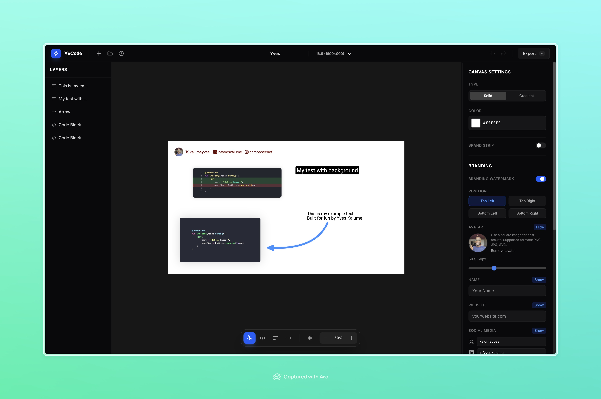

# YvCode

A lightweight code-canvas editor to create export-ready images for social media (code blocks, text, arrows, backgrounds, and branding).



## Features

- Canvas editor built on Konva (move/resize/rotate elements)
- Elements: Code block, Text, Arrow
- Backgrounds: solid + gradient, optional brand strip
- Branding overlay (name/title/avatar + social handles)
- Layers panel (reorder, lock, hide/show)
- Export image: PNG or JPEG (2x)
- Project files: export/import as JSON
- Recent projects list (local)
- Undo/Redo + keyboard shortcuts

## Keyboard shortcuts

- New canvas: `⌘N`
- Open project JSON: `⌘O`
- Export project JSON: `⌘S`
- Undo / Redo: `⌘Z` / `⇧⌘Z`
- Duplicate selected: `⌘D`
- Delete selected: `Backspace` / `Delete`
- Zoom in/out: `⌘+` / `⌘-`
- Toggle grid: `⌘;`
- Tools: Select `V`, Code `C`, Text `T`, Arrow `A`
- Deselect: `Esc`

## Getting started

Requirements: Node.js (recommended: latest LTS)

```bash
npm install
npm run dev
```

Then open the URL printed by Vite.

## Scripts

- `npm run dev` — start the dev server
- `npm run build` — typecheck and build for production
- `npm run preview` — preview the production build
- `npm run lint` — run ESLint

## Docs

- Product spec: [docs/spec.md](docs/spec.md)
- UI design notes: [docs/design.md](docs/design.md)
